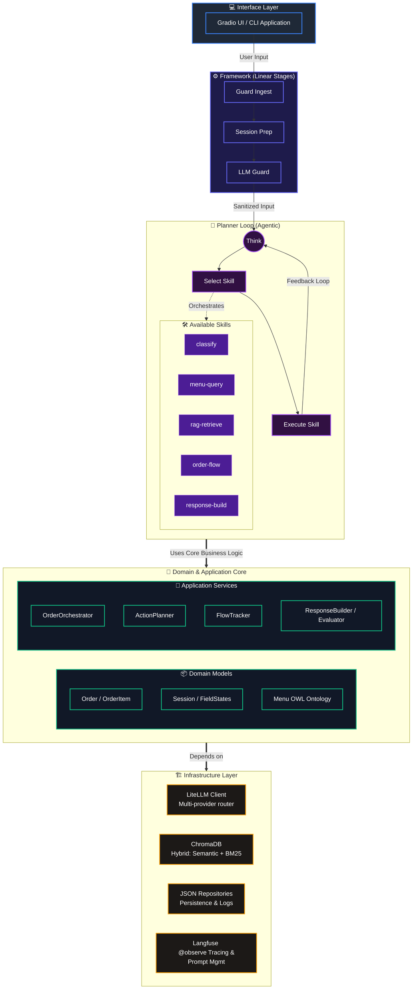

<div align="center">

# Sabor Casero AI

**Skill-based LLM agent for restaurant order management**

Intent classification, RAG retrieval, order orchestration, and response generation — orchestrated by a Planner loop with hybrid provider routing across six LLM backends.

[](#)
[](#)
[](#)
[](#)
[](#)
[](#)

<!--
  TODO: Add a screenshot of the Gradio interface here.
  Recommended: 800px wide, show a conversation with menu query + order flow.
  
-->

One API key. Six providers. A restaurant assistant that takes orders, answers menu questions, and remembers every customer.

</div>

---

## Why this exists

Restaurant chatbots fail for the same reason: they hardcode business rules into prompts. Menu items change, prices shift, and every "just tweak the prompt" request piles onto technical debt.

Sabor Casero flips that. **Business semantics live in the data** — the menu, the order model, the ontology. The LLM reads the menu and understands it independently. When the menu changes, you update a markdown file, not a system prompt.

---

## Execution model

```
message
  │
  ├─ Framework stages (linear, always run)            ← @observe("process_message")
  │   ├─ Input Guard ── quality checks (no LLM)
  │   ├─ Session Prep ── load / create session
  │   └─ LLM Guard ──── context-aware validation
  │
  ├─ Planner loop (agentic, run until done)           ← @observe() per skill
  │   │
  │   │  Each iteration:
  │   │    think → select skill → execute → (repeat or exit)
  │   │
  │   ├─ classify ───── @observe("classify")        hybrid: rules + LLM
  │   ├─ menu-query ─── OWL ontology routing
  │   ├─ rag-retrieve ─ ChromaDB + BM25 multi-signal
  │   ├─ order-flow ─── add / update / confirm / cancel
  │   └─ response-build ─ @observe("build_hybrid")   brand voice + state
  │
  ├─ Memory Store ───── entity extraction → semantic memory
  └─ Summarize ──────── fire-and-forget background task
```

Every LLM call is traced. Every stage is timed. Evaluation scores are pushed back to the same trace for full auditability.

---

## Features

| Capability | Detail |
|---|---|
| **Full observability** | Every interaction traced via Langfuse `@observe()` — prompt versions, latency, token count, and evaluation scores in one place. Prompt Management with file-based fallback. |
| **Multi-provider routing** | Each stage or skill uses a different model via `.env` — classifier on DeepSeek, response on Claude, summarizer on GPT-4o-mini |
| **Hybrid classification** | Rule-based fast-path + LLM fallback for intent and topic detection |
| **RAG with OWL semantics** | ChromaDB vector retrieval fused with BM25 keyword scoring and ontology-based menu routing |
| **Order lifecycle** | `add-item` → `update-item` → `confirm` / `cancel` — partial items allowed, field-level state tracking |
| **Structured grounding** | Field states (`asked`, `answered`, `confirmed`), cross-turn planner history, entity memory injection |
| **Memory hub** | Three memory types: semantic (ChromaDB), episodic (session), procedural (preferences) |
| **Checkpointing** | Per-skill save/restore with crash resume — survive mid-turn failures |
| **Evaluation** | Fire-and-forget LLM-as-judge scoring, scores pushed to Langfuse trace |
| **Two interfaces** | Gradio chat UI (port 7860) + CLI mode |

---

## Quick start

```bash
# Clone and enter
git clone https://github.com/your-username/sabor-casero-agent.git
cd sabor-casero-agent

# Install dependencies
uv sync

# Configure your API key
cp .env.example .env
# Edit .env — set at least DEEPSEEK_API_KEY

# Run the interface
uv run python src/main.py --mode gradio
# → http://localhost:7860
```

> [!NOTE]
> The first run triggers menu ingestion into the ChromaDB vector store. Subsequent runs load from cache.
> To enable Langfuse tracing, set `LANGFUSE_PUBLIC_KEY` and `LANGFUSE_SECRET_KEY` in `.env`.

---

## Architecture

Clean Architecture with three strict layers. Dependencies point inward: infrastructure → application → domain.



### Observability

Langfuse is not an add-on — it is woven into the system:

- **`@observe()` decorator** on `process_message`, every skill entry point, and every LLM call via `LiteLLMClient.chat_completion()`
- **Prompt Management** — `PromptManager` fetches prompts from Langfuse first, falls back to local files. No hardcoded prompts in code.
- **Evaluation scores** — per-criterion scores are pushed to the originating Langfuse trace after each interaction
- **Session propagation** — `session_id` and `user_id` propagate to every span for per-customer filtering
- **LiteLLM compatibility** — includes monkey-patches for Langfuse 4.x compatibility with LiteLLM's callback system

### Project structure

```
src/
├── main.py                         # Entry point
├── config/environment.py           # pydantic-settings (.env → config)
├── engine/                         # Orchestration framework
│   ├── pipeline.py                 #   Framework stages: Guard → Session → Guard
│   ├── orchestrator.py             #   SkillOrchestrator
│   ├── planner.py                  #   Planner loop
│   ├── skill_base.py               #   BaseSkill abstract class
│   ├── skill_registry.py           #   Skill discovery & metadata
│   ├── skill_tools.py              #   Tool schemas & dispatch
│   ├── checkpoint.py               #   Per-skill checkpoint/restore
│   ├── stage_result.py             #   StageResult, SessionContext
│   ├── trace_context.py            #   OpenTelemetry-style tracing
│   ├── exceptions.py               #   PipelineError, StageExecutionError
│   └── validation_gates.py         #   Gate error types
├── core/                           # Domain logic
│   ├── assistant.py                #   Orchestrator entry point
│   ├── classifier/                 #   HybridClassifier (rules + LLM)
│   ├── order/
│   │   ├── domain/                 #   Order, OrderItem, field states
│   │   ├── application/            #   Orchestrator, ActionPlanner
│   │   └── infrastructure/         #   JSON repositories
│   ├── response/                   #   ResponseBuilder
│   ├── extractor/                  #   Retriever + RAG v2 pipeline
│   ├── memory/                     #   MemoryHub + entity extraction
│   ├── conversation_log/           #   Interaction persistence
│   ├── evaluation/                 #   LLM-as-judge evaluator
│   └── knowledge/                  #   Registry
├── infrastructure/                 # LiteLLM client, prompt manager
├── ui/gradio_app.py                # Gradio 6.x chat
├── _deprecated/                    # Legacy code (for reference)
├── prompts/                        # All prompt templates (versioned)
└── tests/                          # pytest (70% coverage floor)
```
src/
├── main.py                         # Entry point
├── config/environment.py           # pydantic-settings (.env → config)
├── core/
│   ├── assistant.py                # Orchestrator entry point
│   ├── classifier/                 # HybridClassifier (rules + LLM)
│   ├── order/
│   │   ├── domain/                 # Order, OrderItem, field states
│   │   ├── application/            # Orchestrator, ActionPlanner, FlowTracker
│   │   └── infrastructure/         # JSON repositories
│   ├── response/                   # ResponseBuilder
│   ├── extractor/                  # Retriever + RAG v2 (multi-signal)
│   ├── memory/                     # MemoryHub + entity extraction
│   ├── agent/                      # SkillOrchestrator, Planner, checkpointing
│   ├── conversation_log/           # Interaction persistence
│   ├── evaluation/                 # LLM-as-judge
│   └── knowledge/                  # Registry
├── infrastructure/
│   ├── litellm_client.py           # Universal LLM client (6 providers)
│   ├── prompt_manager.py           # Langfuse Prompt Management + file fallback
│   └── providers/                  # Provider-specific (legacy)
├── ui/gradio_app.py                # Gradio 6.x chat
├── prompts/                        # All prompt templates (versioned)
└── tests/                          # pytest (70% coverage floor)
```

---

## Configuration

Every stage and skill can use a different model. Set them in `.env` in LiteLLM format:

```ini
# Stage-specific models (LiteLLM format: "provider/model_name")
LLM_MODEL_CLASSIFIER=deepseek/deepseek-v4-flash
LLM_MODEL_RESPONSE=anthropic/claude-3-5-sonnet-20241022
LLM_MODEL_SUMMARIZER=openai/gpt-4o-mini

# Feature flags
USE_LLM_PLANNER=false
USE_OWL=true
EVALUATION_ENABLED=true
```

Prompts live in Langfuse Prompt Management. If Langfuse is unreachable, the system falls back to `prompts/` — zero downtime.

See `.env.example` for the complete reference with all supported provider formats and optional services (Langfuse, Pushover, SendGrid, Resend).

---

## Development

```bash
# Run tests
uv run pytest

# Run with coverage
uv run pytest --cov

# Watch mode (auto-reload on file changes)
uv run python src/main.py --mode gradio --reload

# CLI mode (for debugging without the browser)
uv run python src/main.py --mode cli
```

---

## Contributing

PRs welcome. This project follows **strict TDD** — tests must pass before merging.

1. Fork the repo
2. Branch: `git checkout -b feature/your-feature`
3. Write the test first, then the implementation
4. Verify: `uv run pytest && uv run black . && uv run isort .`
5. Open a PR

Toolchain: `black` (line-length 100), `isort` (black profile), `mypy`, `pytest-cov` (70% minimum).

---

## License

MIT
