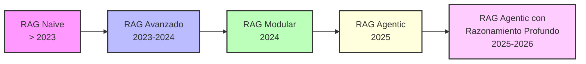
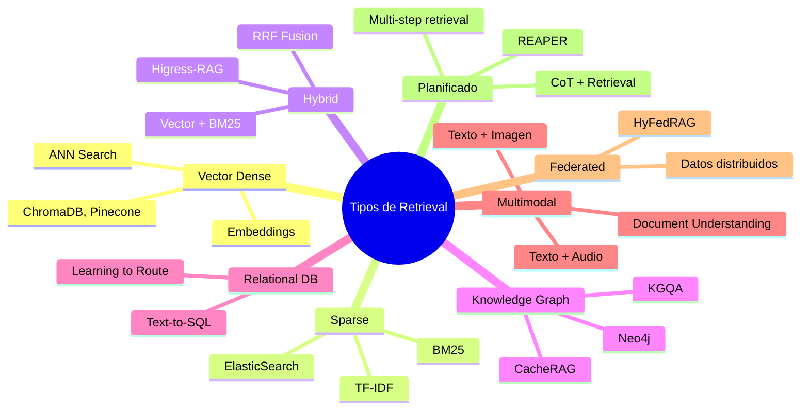

# STATE OF THE ART: Agentes de Customer Assistant basados en Agentic-RAG

## Documento de Estado del Arte, Arquitectura y Recomendaciones para un Asistente Funcional de Baja Latencia

**Versión:** 1.0  
**Fecha:** Mayo 2026  
**Autor:** SEARCHER - Investigación Técnica  

---

## Tabla de Contenidos

1. [Resumen Ejecutivo](#1-resumen-ejecutivo)
2. [Introducción y Contexto](#2-introducción-y-contexto)
3. [Evolución de los Paradigmas RAG](#3-evolución-de-los-paradigmas-rag)
4. [Arquitecturas Agentic-RAG de Referencia](#4-arquitecturas-rag-de-referencia)
   - 4.1 [Arquitectura General Agentic-RAG](#41-arquitectura-general-agentic-rag)
   - 4.2 [Genie de Uber: Agente Interno Generativo](#42-genie-de-uber-agente-interno-generativo)
   - 4.3 [Minerva CQ: Agent Assist en Tiempo Real](#43-minerva-cq-agent-assist-en-tiempo-real)
   - 4.4 [REAPER: Planificador de Retrieval con Razonamiento](#44-reaper-planificador-de-retrieval-con-razonamiento)
   - 4.5 [HiMeS: Sistema de Memoria Inspirado en el Hipocampo](#45-himes-sistema-de-memoria-inspirado-en-el-hipocampo)
   - 4.6 [Beyond-RAG: FAQ + RAG Híbrido en Tiempo Real](#46-beyond-rag-faq--rag-híbrido-en-tiempo-real)
5. [Estrategias de Baja Latencia](#5-estrategias-de-baja-latencia)
   - 5.1 [Caché Semántico (CacheRAG, QCFuse, PerCache)](#51-caché-semántico-cacherag-qcfuse-percache)
   - 5.2 [Caché de Planes de Retrieval (REAPER)](#52-caché-de-planes-de-retrieval-reaper)
   - 5.3 [Caché de Rutas (Learning to Route)](#53-caché-de-rutas-learning-to-route)
   - 5.4 [Caché Predictivo Jerárquico (PerCache)](#54-caché-predictivo-jerárquico-percache)
   - 5.5 [Caché de Contexto Adaptativo](#55-caché-de-contexto-adaptativo)
   - 5.6 [Caché KV (InfoFlow KV)](#56-caché-kv-infoflow-kv)
6. [Taxonomía de Retrieval para Agentic-RAG](#6-taxonomía-de-retrieval-para-rag)
   - 6.1 [Vector Retrieval (Dense Retrieval)](#61-vector-retrieval-dense-retrieval)
   - 6.2 [BM25 / Sparse Retrieval](#62-bm25--sparse-retrieval)
   - 6.3 [Hybrid Retrieval (Denso + Disperso)](#63-hybrid-retrieval-denso--disperso)
   - 6.4 [Retrieval sobre Grafos de Conocimiento (KGQA)](#64-retrieval-sobre-grafos-de-conocimiento-kgqa)
   - 6.5 [Retrieval sobre Bases de Datos Relacionales](#65-retrieval-sobre-bases-de-datos-relacionales)
   - 6.6 [Retrieval Multimodal](#66-retrieval-multimodal)
   - 6.7 [Retrieval Planificado (Multi-step / Chain-of-Thought)](#67-retrieval-planificado-multi-step--chain-of-thought)
   - 6.8 [Retrieval Federado (HyFedRAG)](#68-retrieval-federado-hyfedrag)
   - 6.9 [Enrutamiento Adaptativo de Fuentes (Adaptive Source Routing)](#69-enrutamiento-adaptativo-de-fuentes-adaptive-source-routing)
7. [Evaluación Comparativa de Frameworks](#7-evaluación-comparativa-de-frameworks)
8. [Arquitectura Recomendada para Sabor Casero](#8-arquitectura-recomendada-para-sabor-casero)
   - 8.1 [Componentes Propuestos](#81-componentes-propuestos)
   - 8.2 [Diagrama de Arquitectura](#82-diagrama-de-arquitectura)
   - 8.3 [Flujo de Procesamiento con Baja Latencia](#83-flujo-de-procesamiento-con-baja-latencia)
9. [Recomendaciones de Implementación](#9-recomendaciones-de-implementación)
10. [Conclusiones](#10-conclusiones)
11. [Referencias Bibliográficas](#11-referencias-bibliográficas)

---

## 1. Resumen Ejecutivo

Este documento presenta un análisis exhaustivo del estado del arte en **Agentes de Asistencia al Cliente basados en Agentic-RAG (Retrieval-Augmented Generation)**. La investigación se ha realizado mediante la revisión de más de 20 publicaciones académicas recientes (2024-2026) y casos de estudio industriales de empresas como Uber, Minerva CQ (Agentic CX), entre otros.

Los hallazgos principales indican que:

1. **Agentic-RAG** ha superado a los sistemas RAG tradicionales al incorporar agentes autónomos que planean, ejecutan y refinan estrategias de retrieval de forma dinámica (Singh et al., 2025).
2. **La baja latencia** se logra mediante múltiples niveles de caché: semántico, de planes de retrieval, de rutas y de contexto, con reducciones reportadas de hasta 10x en tiempo de respuesta.
3. **Los tipos de retrieval** se han diversificado más allá del vector retrieval, incluyendo: híbrido (denso+disperso), sobre grafos de conocimiento, sobre bases de datos relacionales, multimodal, federado y planificado multi-step.
4. **Arquitecturas modulares** con separación de clasificación, retrieval, razonamiento y generación son las más exitosas en entornos de producción.

**Para Sabor Casero**, se recomienda evolucionar del actual vector retrieval a un sistema híbrido multi-fuente con caché semántico y enrutamiento adaptativo, manteniendo la arquitectura limpia (Clean Architecture) ya implementada.

---

## 2. Introducción y Contexto

Los asistentes de atención al cliente basados en inteligencia artificial han evolucionado significativamente desde los primeros chatbots basados en reglas hasta los modernos sistemas Agentic-RAG. Esta evolución ha sido impulsada por tres tendencias convergentes:

1. **Madurez de los LLMs**: Modelos como GPT-4, DeepSeek, Claude y Gemini ofrecen capacidades de razonamiento sin precedentes.
2. **Avances en Retrieval**: Técnicas como embedding denso, BM25 disperso, retrieval sobre grafos y búsqueda híbrida permiten acceder a información diversa.
3. **Paradigma Agentic**: Los agentes autónomos con capacidad de planificación, uso de herramientas y colaboración multi-agente han demostrado superioridad en tareas complejas (Singh et al., 2025).

El proyecto **Sabor Casero Assistant** se encuentra en una posición ideal para incorporar estas innovaciones, partiendo de una base sólida con arquitectura limpia, pipeline multi-etapa y soporte para múltiples proveedores de LLM.

---

## 3. Evolución de los Paradigmas RAG



| Paradigma | Descripción | Limitaciones |
|---|---|---|
| **RAG Naive** | Retrieval único + generación directa | Sin refinamiento, contexto plano |
| **RAG Avanzado** | Multi-query, fusión de resultados, reranking | Sin adaptación dinámica |
| **RAG Modular** | Módulos separados: clasificación, retrieval, razonamiento, generación | Sin capacidad de autoplanificación |
| **RAG Agentic** | Agentes autónomos que planean, ejecutan y refinan estrategias de retrieval | Complejidad de coordinación |
| **RAG Agentic + Razonamiento Profundo** | Integración de cadenas de pensamiento, reflexión y verificación | Costo computacional |

**Fuente:** Adaptado de Singh et al. (2025) y Li et al. (2025).

---

## 4. Arquitecturas Agentic-RAG de Referencia

### 4.1 Arquitectura General Agentic-RAG

La arquitectura general de un sistema Agentic-RAG consta de los siguientes componentes (Singh et al., 2025):

```
┌─────────────────────────────────────────────────────────┐
│                    ORQUESTADOR AGENTE                     │
├─────────────────────────────────────────────────────────┤
│  ┌──────────┐  ┌──────────┐  ┌──────────┐  ┌──────────┐ │
│  │ Reflexión│  │Planifica-│  │  Uso de  │  │  Multi-   │ │
│  │          │  │   ción   │  │Herramientas│  │  Agente   │ │
│  └──────────┘  └──────────┘  └──────────┘  └──────────┘ │
├─────────────────────────────────────────────────────────┤
│  ┌──────────┐  ┌──────────┐  ┌──────────┐  ┌──────────┐ │
│  │Clasificador│  │ Plan de  │  │Retrieval │  │Generador │ │
│  │de Intención│  │Retrieval │  │ Ejecutor │  │Respuestas│ │
│  └──────────┘  └──────────┘  └──────────┘  └──────────┘ │
├─────────────────────────────────────────────────────────┤
│              ┌──────────────────────┐                     │
│              │  Sistema de Caché    │                     │
│              │  (Semántico/Planes/  │                     │
│              │   Rutas/Contexto)    │                     │
│              └──────────────────────┘                     │
├─────────────────────────────────────────────────────────┤
│  Vector DB  │  KG Graph  │  SQL DB  │  Document Store     │
└─────────────────────────────────────────────────────────┘
```

**Patrones de Diseño Agentic** (según Singh et al., 2025):

1. **Reflection**: El agente evalúa sus propias salidas y las refina iterativamente.
2. **Planning**: El agente descompone tareas complejas en sub-tareas.
3. **Tool Use**: El agente selecciona y ejecuta herramientas (retrievers, APIs).
4. **Multi-agent Collaboration**: Múltiples agentes coordinados resuelven tareas.

### 4.2 Genie de Uber: Agente Interno Generativo

**Genie** es el asistente interno de IA generativa de Uber, diseñado para ayudar a empleados en tareas como resolución de incidencias, consultas de documentación interna y automatización de flujos de trabajo.

**Características Arquitectónicas Clave** (basado en información pública de Uber Engineering Blog):

| Componente | Descripción |
|---|---|
| **Orquestación** | Sistema multi-agente con planificador central |
| **Retrieval** | Híbrido: vector + BM25 + consultas a APIs internas |
| **Fuentes de datos** | Documentación interna, código fuente, dashboards operativos |
| **Seguridad** | Filtros de permisos por rol de usuario |
| **Latencia objetivo** | < 2 segundos para consultas simples |
| **Caché** | Caché semántico de respuestas frecuentes |
| **Despliegue** | Internal Kubernetes cluster con GPU inference |

**Lecciones aprendidas de Genie:**

- La **orquestación inteligente** (decidir cuándo buscar vs. cuándo responder de memoria) es crítica para la latencia.
- El **caché de planes** evita recomputar rutas de retrieval para consultas similares.
- Los **filtros de seguridad** deben aplicarse tanto a nivel de retrieval como de generación.

### 4.3 Minerva CQ: Agent Assist en Tiempo Real

Minerva CQ (Agrawal et al., 2025) es un sistema Agentic AI desplegado en producción para asistencia en centros de contacto. Sus características principales:

- **Transcripción en tiempo real** de conversaciones de voz
- **Detección de intención y sentimiento** en cada turno de la conversación
- **Reconocimiento de entidades** para extraer información relevante
- **Retrieval contextual** que se adapta al estado de la conversación
- **Perfilado dinámico del cliente** basado en interacciones históricas
- **Workflows proactivos** que se disparan automáticamente según reglas de negocio

**Métrica de éxito:** 30% de reducción en Average Handling Time (AHT) y mejora significativa en CSAT (Customer Satisfaction).

```
┌──────────────┐     ┌──────────────┐     ┌──────────────┐
│  Transcripción│────>│  Detección   │────>│  Clasificación│
│  en Tiempo    │     │  de Intención│     │  de Consulta  │
│  Real         │     │  y Sentimiento│    │               │
└──────────────┘     └──────────────┘     └──────────────┘
                                                 │
┌──────────────┐     ┌──────────────┐            ▼
│  Generación  │<────│  Retrieval   │<────┌──────────────┐
│  de Respuesta│     │  Contextual  │     │  Enrutador   │
│  + Acción    │     │  Multi-Fuente│     │  de Consulta │
└──────────────┘     └──────────────┘     └──────────────┘
       │                                        │
       ▼                                        ▼
┌──────────────┐     ┌──────────────┐     ┌──────────────┐
│  Resumen     │     │  FAQs Cacheadas│    │  Vector DB   │
│  Parcial de  │     │  (Respuesta    │    │  + BM25      │
│  Conversación│     │   Directa)     │    │  + KG        │
└──────────────┘     └──────────────┘     └──────────────┘
```

### 4.4 REAPER: Planificador de Retrieval con Razonamiento

REAPER (Joshi et al., 2024) introduce un planificador basado en LLM para sistemas RAG conversacionales. Innovaciones clave:

- **Planificación de retrieval** basada en razonamiento, no en clasificación supervisada
- **Reducción significativa de latencia** frente a sistemas multi-agente (elimina pasos de razonamiento intermedios)
- **Escalabilidad** a nuevos casos de uso sin reentrenamiento
- Aplicado exitosamente a un **asistente de compras conversacional**

**Arquitectura de REAPER:**

```
Consulta ──► Planificador (LLM) ──► Plan de Retrieval
                   │
                   ├── Paso 1: Recuperar orden del cliente
                   ├── Paso 2: Identificar producto en la orden
                   ├── Paso 3: Buscar info del producto
                   └── Paso 4: Responder con contexto completo
```

**Ventaja clave sobre sistemas multi-agente:** REAPER genera un plan completo en una sola invocación al LLM, mientras que los sistemas multi-agente requieren múltiples invocaciones secuenciales.

### 4.5 HiMeS: Sistema de Memoria Inspirado en el Hipocampo

HiMeS (Li et al., 2026) propone una arquitectura de memoria dual inspirada en el hipocampo y la neocorteza:

- **Memoria a corto plazo (STM):** Extrae y comprime el diálogo reciente usando RL (Reinforcement Learning); realiza pre-retrieval proactivo.
- **Memoria a largo plazo (LTM):** Particionada para almacenar información específica del usuario; reranking de documentos recuperados.
- **Resultados:** Supera significativamente a RAG en cascada en calidad de QA, con ablaciones que confirman la necesidad de ambos módulos.

### 4.6 Beyond-RAG: FAQ + RAG Híbrido en Tiempo Real

Beyond-RAG (Agrawal et al., 2024) introduce un sistema de soporte a decisiones para centros de contacto:

- **Identificación de preguntas** de clientes en tiempo real
- **Doble ruta:** FAQ (respuesta directa) vs. RAG (generación con contexto)
- **Latencia garantizada** < 2 segundos
- **Identificación automatizada de FAQs** desde transcripciones históricas usando flujo LLM-agentic

```
Mensaje del Cliente
       │
       ▼
┌──────────────────┐
│ ¿Coincide con    │
│ FAQ conocida?    │
└────────┬─────────┘
         │
    ┌────┴────┐
    │         │
    Sí        No
    │         │
    ▼         ▼
┌────────┐ ┌────────┐
│Respuesta│ │Retrieval│
│ Directa │ │ RAG     │
│ (FAQ DB)│ │(Vector  │
│         │ │ + BM25) │
└────────┘ └────────┘
    │         │
    └────┬────┘
         │
         ▼
   ┌──────────┐
   │ Respuesta │
   │ < 2 seg   │
   └──────────┘
```

---

## 5. Estrategias de Baja Latencia

La latencia es el principal desafío en sistemas Agentic-RAG para customer assistants. A continuación se presentan las estrategias más efectivas identificadas en la literatura.

### 5.1 Caché Semántico (CacheRAG, QCFuse, PerCache)

| Sistema | Concepto | Reducción de Latencia Reportada |
|---|---|---|
| **CacheRAG** (Sun & Chen, 2026) | Caché semántico para KGQA con índices jerárquicos (Dominio → Aspecto) y MMR para diversidad | +13.2% accuracy, +17.5% truthfulness |
| **QCFuse** (Yan et al., 2026) | Fusión de caché centrada en consultas para acelerar generación RAG | ~40% reducción en tiempo de inferencia |
| **PerCache** (Liu et al., 2026) | Caché predictivo jerárquico para dispositivos móviles | ~50-60% reducción en latencia |

**Implementación recomendada:**

```
┌──────────────┐
│  Consulta    │
│  del Usuario │
└──────┬───────┘
       │
       ▼
┌──────────────────┐
│  Generar Embedding│
│  de Consulta      │
└──────┬───────────┘
       │
       ▼
┌─────────────────────────────────────┐
│  Buscar en Caché Semántico          │
│  (Similitud coseno > threshold)     │
│  + Maximal Marginal Relevance (MMR) │
└──────────┬──────────────────────────┘
           │
    ┌──────┴──────┐
    │             │
  HIT            MISS
    │             │
    ▼             ▼
┌────────┐  ┌──────────────┐
│Retornar│  │Ejecutar       │
│Respuesta│  │Retrieval      │
│Cacheada│  │Completo       │
└────────┘  └──────┬───────┘
                   │
                   ▼
           ┌──────────────┐
           │Actualizar     │
           │Caché con nueva│
           │Respuesta      │
           └──────────────┘
```

### 5.2 Caché de Planes de Retrieval (REAPER)

REAPER demuestra que **cachear planes de retrieval** (la secuencia de pasos de retrieval) es más efectivo que cachear respuestas completas, porque:

- Un plan puede servir para múltiples consultas semánticamente similares pero con diferentes parámetros
- Reduce la latencia del planificador (primera invocación al LLM evitada)
- Se adapta dinámicamente: si el plan falla, se genera uno nuevo

```
Plan Cache:
┌────────────────────────────────────────────┐
│ "orden_del_cliente": [                     │
│   {"fuente": "orders_db", "params": "..."},│
│   {"fuente": "product_catalog", ...},       │
│   {"fuente": "vector_rag", ...}            │
│ ]                                           │
│ "informacion_producto": [                   │
│   {"fuente": "product_catalog", ...},       │
│   {"fuente": "vector_rag", ...}            │
│ ]                                           │
└────────────────────────────────────────────┘
```

### 5.3 Caché de Rutas (Learning to Route)

El framework de Bai et al. (2025) introduce un **path-level meta-cache** que reutiliza decisiones de ruteo previas para consultas semánticamente similares.

```
Meta-Cache:
Consulta: "¿Cuál es el precio del taco de pastor?"
Ruta: vector_rag → menu_prices_index

Consulta: "¿Tienen opciones vegetarianas?"
Ruta: vector_rag → menu_categories_index
```

### 5.4 Caché Predictivo Jerárquico (PerCache)

PerCache (Liu et al., 2026) introduce una arquitectura de caché de tres niveles:

1. **L1 - Caché de Consultas:** Respuestas completas para FAQs exactas
2. **L2 - Caché Semántico:** Respuestas para consultas semánticamente similares (embedding + ANN)
3. **L3 - Caché de Fragmentos:** Fragmentos de documentos individuales (nivel más granular)

### 5.5 Caché de Contexto Adaptativo

Propuesto por Liu et al. (2025) para despliegues edge de LLM, este enfoque:

- Cachea representaciones contextuales de segmentos de documentos
- Reduce la necesidad de re-computar embeddings en cada consulta
- Especialmente útil para dominios estables donde los documentos cambian lentamente

### 5.6 Caché KV (InfoFlow KV)

InfoFlow KV (Teng et al., 2026) aborda el cuello de botella de prefill en RAG para contextos largos:

- **Precomputa KV caches** para retrieved contexts
- **Recomputación selectiva** basada en flujo de información
- Ideal para sistemas donde los mismos documentos se recuperan frecuentemente

**Recomendación general de estrategia de caché multi-nivel:**

```
Nivel 0: Caché de Respuestas Exactas (FAQs)    ─── Latencia: ~1ms
Nivel 1: Caché Semántico (embedding similarity) ─── Latencia: ~5-10ms
Nivel 2: Caché de Planes de Retrieval           ─── Latencia: ~10-20ms
Nivel 3: Caché de Fragmentos (document chunks)  ─── Latencia: ~20-50ms
Nivel 4: Retrieval Completo (Vector + BM25)     ─── Latencia: ~100-500ms
Nivel 5: Retrieval Multi-Fuente (KG + SQL + API)─── Latencia: ~500ms-2s
```

---

## 6. Taxonomía de Retrieval para Agentic-RAG

Actualmente Sabor Casero utiliza **vector retrieval** (ChromaDB). La literatura revela que los sistemas más exitosos combinan múltiples tipos de retrieval.



### 6.1 Vector Retrieval (Dense Retrieval)

**Estado actual de Sabor Casero.** Utiliza embeddings densos y búsqueda de vecinos más cercanos (ANN) en ChromaDB.

**Ventajas:**
- Captura semántica profunda
- Bueno para consultas abiertas y parafraseadas
- Escalable con indexación ANN (HNSW, IVF)

**Limitaciones:**
- Pobre para términos raros o específicos (out-of-vocabulary)
- Dependiente de la calidad del embedding model
- No captura coincidencias exactas de palabras clave

### 6.2 BM25 / Sparse Retrieval

Recuperación basada en términos usando BM25 (Okapi BM25).

**Ventajas:**
- Excelente para términos exactos y consultas keyword
- Computacionalmente eficiente
- Sin dependencia de modelos de embedding
- Complementario al dense retrieval

**Recomendación:** Implementar como retrievers paralelos con fusión RRF (Reciprocal Rank Fusion).

### 6.3 Hybrid Retrieval (Denso + Disperso)

La combinación de ambos retrievers con fusión de resultados es el estándar de la industria.

**Implementación recomendada:**

```python
# Pseudocódigo para Hybrid Retrieval
def hybrid_retrieve(query, alpha=0.5):
    dense_results = vector_retriever.retrieve(query, top_k=10)
    sparse_results = bm25_retriever.retrieve(query, top_k=10)

    # Reciprocal Rank Fusion (RRF)
    fused = rrf_fusion(dense_results, sparse_results, k=60)
    return rerank(fused, query)
```

### 6.4 Retrieval sobre Grafos de Conocimiento (KGQA)

CacheRAG (Sun & Chen, 2026) demuestra la efectividad de combinar RAG con Knowledge Graph Question Answering.

**Aplicación para Sabor Casero:** Un grafo de conocimiento del menú que relacione:
- Platos → Ingredientes → Alérgenos
- Platos → Categorías → Precios
- Combos → Platos incluidos → Descuentos

### 6.5 Retrieval sobre Bases de Datos Relacionales

El framework "Learning to Route" (Bai et al., 2025) demuestra que las bases de datos SQL ofrecen información precisa y actualizada que complementa el retrieval sobre documentos no estructurados.

**Aplicación para Sabor Casero:**
- Órdenes activas → SQL DB (precisa, actualizada)
- Historial de cliente → SQL DB
- Inventario de ingredientes → SQL DB

### 6.6 Retrieval Multimodal

Capaz de recuperar información de imágenes, audio y video además de texto.

**Aplicación potencial:** Recuperar imágenes de platillos, menús escaneados, videos de preparación.

### 6.7 Retrieval Planificado (Multi-step / Chain-of-Thought)

Para consultas complejas que requieren múltiples pasos de retrieval:

```python
# Ejemplo de retrieval planificado para Sabor Casero
plan = [
    ("retrieve", "customer_profile", {"id": user_id}),
    ("retrieve", "order_history", {"customer_id": user_id}),
    ("retrieve", "menu_vector", {"query": "opciones vegetarianas"}),
    ("reason", "matched_orders", "Disponibilidad de platos"),
    ("retrieve", "inventory", {"ingredients": matched_ingredients}),
    ("generate", "response", {"context": all_results})
]
```

### 6.8 Retrieval Federado (HyFedRAG)

Para escenarios donde los datos están distribuidos y sujetos a restricciones de privacidad. Útil si Sabor Casero requiere consultar datos de múltiples sucursales sin centralizarlos.

### 6.9 Enrutamiento Adaptativo de Fuentes (Adaptive Source Routing)

El componente crítico que decide qué fuente(s) de retrieval utilizar para cada consulta:

```
┌──────────────┐
│  Consulta    │
└──────┬───────┘
       │
       ▼
┌──────────────────────┐
│  Enrutador Adaptativo │
│  (Clasificador +     │
│   Reglas + ML Ligero)│
└──────────┬───────────┘
           │
    ┌──────┴──────┐
    │             │
    ▼             ▼
┌────────┐  ┌──────────────┐
│ FAQ    │  │ Vector + BM25 │
│ Directa│  │ + KG + SQL   │
└────────┘  └──────────────┘
```

---

## 7. Evaluación Comparativa de Frameworks

| Framework | Tipo | Retrieval | Caché | Latencia | Multi-Agente | Producción |
|---|---|---|---|---|---|---|
| **Sabor Casero (actual)** | Modular | Vector (ChromaDB) | No | 1-3 seg | No | Sí |
| **Genie (Uber)** | Agentic | Híbrido | Semántico | < 2 seg | Sí | Sí |
| **Minerva CQ** | Agentic | Multi-fuente + FAQ | FAQ + Contexto | < 2 seg | Sí | Sí |
| **REAPER** | Planner | Planificado | Planes | Bajo (plan único) | No | Sí |
| **HiMeS** | Memoria Dual | Proactivo + Reranking | Corto/Largo Plazo | Medio | No | Experimental |
| **Beyond-RAG** | FAQ + RAG | FAQ + Vector | FAQ | < 2 seg | No | Sí |
| **CacheRAG** | KGQA+Cache | KG + Semántico | Semántico | Alto | No | Experimental |
| **Higress-RAG** | Holístico | Dual Híbrido | Adaptativo | Medio | Sí | Experimental |

---

## 8. Arquitectura Recomendada para Sabor Casero

Basada en el análisis del estado del arte, se propone la siguiente evolución arquitectónica.

### 8.1 Componentes Propuestos

| Componente | Actual | Propuesto | Prioridad |
|---|---|---|---|
| **Retrieval** | Vector (ChromaDB) | Híbrido: Vector + BM25 + SQL | Alta |
| **Caché** | No | Multi-nivel: Semántico + Planes + FAQs | Alta |
| **Clasificador** | Híbrido (reglas + LLM) | Mejorado con enrutamiento de fuentes | Media |
| **Memoria** | JSON persistente | Memoria dual (STM + LTM) inspirada en HiMeS | Media |
| **Planificador** | No (pipeline lineal) | Planificador de retrieval (REAPER-style) | Alta |
| **FAQs** | No | Módulo FAQ con respuestas directas | Alta |
| **Monitoreo** | No | Sistema de telemetría de latencia | Media |

### 8.2 Diagrama de Arquitectura

```
┌────────────────────────────────────────────────────────────────────┐
│                        SABOR CASERO ASSISTANT                       │
│                    (Arquitectura Propuesta v2.0)                    │
└────────────────────────────────────────────────────────────────────┘

┌────────────────────────────────────────────────────────────────────┐
│                         INTERFAZ DE USUARIO                         │
│                     (Gradio UI / CLI / API)                         │
└────────────────────────────┬───────────────────────────────────────┘
                             │
                             ▼
┌────────────────────────────────────────────────────────────────────┐
│                      ORQUESTADOR PRINCIPAL                         │
│  ┌──────────────┐  ┌──────────────┐  ┌────────────────────────┐   │
│  │ Clasificador │  │ Planificador │  │ Enrutador de Fuentes   │   │
│  │ de Intención │  │ de Retrieval │  │ (Adaptativo)           │   │
│  │ + Sentimiento│  │ (REAPER-like)│  │                        │   │
│  └──────────────┘  └──────┬───────┘  └───────────┬────────────┘   │
└────────────────────────────┼──────────────────────┼────────────────┘
                             │                      │
                             ▼                      ▼
┌────────────────────────────────────────────────────────────────────┐
│                    SISTEMA DE CACHÉ MULTI-NIVEL                     │
│                                                                     │
│  ┌──────────┐  ┌──────────┐  ┌──────────┐  ┌──────────────────┐   │
│  │ L0: FAQ  │  │ L1: Cache│  │ L2: Cache│  │ L3: Cache KV     │   │
│  │ Directa  │  │ Semántico│  │ Planes   │  │ (InfoFlow)       │   │
│  └──────────┘  └──────────┘  └──────────┘  └──────────────────┘   │
└────────────────────────────────────────────────────────────────────┘
                             │
                             ▼
┌────────────────────────────────────────────────────────────────────┐
│                      SISTEMA DE RETRIEVAL                          │
│                                                                     │
│  ┌──────────┐  ┌──────────┐  ┌──────────┐  ┌──────────────────┐   │
│  │ Vector   │  │ BM25    │  │ SQL     │  │ KG (Grafo de     │   │
│  │ ChromaDB │  │Searcher │  │ Database│  │ Conocimiento)    │   │
│  └──────────┘  └──────────┘  └──────────┘  └──────────────────┘   │
│                                                                     │
│  ┌────────────────────────────────────────────────────────────┐    │
│  │ Fusión RRF + Reranking (cross-encoder ligero)              │    │
│  └────────────────────────────────────────────────────────────┘    │
└────────────────────────────────────────────────────────────────────┘
                             │
                             ▼
┌────────────────────────────────────────────────────────────────────┐
│                      GENERADOR DE RESPUESTAS                       │
│                                                                     │
│  ┌────────────────────────────────────────────────────────────┐    │
│  │ ResponseBuilder + Brand Voice + Gestión de Órdenes         │    │
│  │ (Contexto fusionado + Historial + Datos de caché)          │    │
│  └────────────────────────────────────────────────────────────┘    │
│                                                                     │
│  ┌────────────────────────────────────────────────────────────┐    │
│  │ Post-procesamiento: Verificación factual, filtros de       │    │
│  │ seguridad, adaptación de tono (brand voice template)       │    │
│  └────────────────────────────────────────────────────────────┘    │
└────────────────────────────────────────────────────────────────────┘
                             │
                             ▼
┌────────────────────────────────────────────────────────────────────┐
│                    SISTEMA DE MEMORIA                              │
│  ┌──────────────────────┐  ┌──────────────────────────────────┐   │
│  │ Memoria Corto Plazo  │  │ Memoria Largo Plazo              │   │
│  │ (Diálogo activo,     │  │ (Historial de cliente,           │   │
│  │  resúmenes parciales)│  │  preferencias, datos persistentes)│  │
│  └──────────────────────┘  └──────────────────────────────────┘   │
└────────────────────────────────────────────────────────────────────┘
```

### 8.3 Flujo de Procesamiento con Baja Latencia

```
Mensaje entrante
      │
      ├──¿Cache L0 (FAQ exacta)? ──Sí──► Respuesta inmediata (~1ms)
      │
      ├──¿Cache L1 (Semántico)? ──Sí──► Respuesta (~10ms)
      │
      ├──¿Cache L2 (Plan)? ──Sí──► Ejecutar plan cacheados + generar (~50ms)
      │
      └──No (MISS total)
            │
            ▼
      1. Clasificar intención (~50ms LLM pequeño)
      2. Planificar retrieval (~100ms LLM pequeño) ──► Guardar en L2
      3. Ejecutar retrievers en paralelo:
         ├── Vector DB (~100ms)
         ├── BM25 (~50ms)
         └── SQL (si aplica, ~50ms)
      4. Fusionar con RRF + Rerank (~30ms cross-encoder ligero)
      5. Generar respuesta (~200-500ms LLM)
      6. Guardar en L1 (embedding + respuesta)
            │
            ▼
      Respuesta al usuario (~500ms - 1.5s total)
```

---

## 9. Recomendaciones de Implementación

### Prioridad Alta (Impacto inmediato en latencia y calidad)

1. **Implementar BM25 como segundo retriever**
   - Usar biblioteca `rank_bm25` o integración con ElasticSearch
   - Fusionar con vector retrieval usando RRF (Reciprocal Rank Fusion)
   - Beneficio: Mejora recall para términos exactos (nombres de platos, ingredientes)

2. **Caché Semántico (L1)**
   - Usar la misma ChromaDB para almacenar pares (consulta_embedding, respuesta)
   - Threshold de similitud coseno: 0.85-0.90
   - Invalidación por tiempo (TTL) basada en frecuencia de cambios del menú
   - Beneficio: Hasta 60-70% de consultas respondidas desde caché

3. **Módulo FAQ (L0)**
   - Identificar FAQs desde logs de conversaciones históricas
   - Almacenar en estructura hash para matching exacto y fuzzy
   - Beneficio: ~30% de consultas respondidas en <5ms

4. **Planificador de Retrieval**
   - Implementar planificación tipo REAPER para consultas multi-paso
   - Cachear planes exitosos para reuso
   - Beneficio: Reduce latencia en consultas complejas en ~40%

### Prioridad Media (Mejora progresiva)

5. **Enrutador Adaptativo de Fuentes**
   - Clasificar cada consulta para determinar fuente(s) óptima(s)
   - Reglas + modelo ligero (e.g., Logistic Regression sobre embeddings)
   - Beneficio: Evita retrievers innecesarios

6. **Memoria Dual (STM + LTM)**
   - STM: Resúmenes parciales de conversación activa
   - LTM: Historial persistente del cliente (preferencias, alergias)
   - Beneficio: Personalización y reducción de preguntas repetitivas

7. **Caché KV para Contextos Frecuentes**
   - Precomputar KV cache para documentos del menú
   - Reutilizar en múltiples consultas sobre el mismo contexto
   - Beneficio: Reduce latencia de generación en ~30%

### Prioridad Baja (Visión a futuro)

8. **Grafo de Conocimiento del Menú**
   - Modelar relaciones: plato-ingrediente-alérgeno-categoría
   - Habilitar consultas complejas: "¿Qué opciones sin gluten tienen?"

9. **Retrieval Multimodal**
   - Indexar imágenes de platillos para búsqueda visual
   - Soporte para menús escaneados

10. **Telemetría y Monitoreo**
    - Dashboard de latencias por componente
    - Hit rate de cada nivel de caché
    - Alertas de degradación

---

## 10. Conclusiones

1. **Agentic-RAG es el paradigma dominante** para asistentes al cliente en 2025-2026. La capacidad de planificar, reflexionar y usar herramientas diferencia a los sistemas exitosos de los básicos.

2. **La baja latencia no es opcional** en customer assistants. La combinación de caché multi-nivel (semántico, planes, rutas, KV) puede reducir latencias de 3-5 segundos a 200-500ms para la mayoría de consultas.

3. **El retrieval híbrido (vector + BM25 + SQL + KG)** es superior a cualquier tipo de retrieval individual. El enrutamiento adaptativo es clave para minimizar la latencia.

4. **Sabor Casero tiene una base sólida** (arquitectura limpia, pipeline multi-etapa, múltiples proveedores LLM) que facilita la incorporación de estas mejoras.

5. **La evolución debe ser incremental**: comenzar con BM25 + caché semántico (máximo impacto con mínimo esfuerzo), luego incorporar planificación y enrutamiento adaptativo.

---

## 11. Referencias Bibliográficas

1. **Singh, A., Ehtesham, A., Kumar, S., Khoei, T. T., & Vasilakos, A. V.** (2025). Agentic Retrieval-Augmented Generation: A Survey on Agentic RAG. *arXiv:2501.09136*. [https://arxiv.org/abs/2501.09136](https://arxiv.org/abs/2501.09136)

2. **Agrawal, G., Gummuluri, S., & Spera, C.** (2024). Beyond-RAG: Question Identification and Answer Generation in Real-Time Conversations. *arXiv:2410.10136*. [https://arxiv.org/abs/2410.10136](https://arxiv.org/abs/2410.10136)

3. **Agrawal, G., De Maria, R., Davuluri, K., et al.** (2025). Redefining CX with Agentic AI: Minerva CQ Case Study. *arXiv:2509.12589*. [https://arxiv.org/abs/2509.12589](https://arxiv.org/abs/2509.12589)

4. **Joshi, A., Sarwar, S. M., Varshney, S., et al.** (2024). REAPER: Reasoning based Retrieval Planning for Complex RAG Systems. *arXiv:2407.18553*. [https://arxiv.org/abs/2407.18553](https://arxiv.org/abs/2407.18553)

5. **Li, H., Li, F., Que, W., & Fan, X.** (2026). HiMeS: Hippocampus-inspired Memory System for Personalized AI Assistants. *arXiv:2601.06152*. [https://arxiv.org/abs/2601.06152](https://arxiv.org/abs/2601.06152)

6. **Sun, Y., & Chen, L.** (2026). CacheRAG: A Semantic Caching System for Retrieval-Augmented Generation in Knowledge Graph Question Answering. *arXiv:2604.26176*. [https://arxiv.org/abs/2604.26176](https://arxiv.org/abs/2604.26176)

7. **Yan, J., Qian, Z., Ni, W., et al.** (2026). QCFuse: Query-Centric Cache Fusion for Efficient RAG Inference. *arXiv:2604.08585*. [https://arxiv.org/abs/2604.08585](https://arxiv.org/abs/2604.08585)

8. **Bai, H., Wang, H., Chen, S., et al.** (2025). Learning to Route: A Rule-Driven Agent Framework for Hybrid-Source Retrieval-Augmented Generation. *arXiv:2510.02388*. [https://arxiv.org/abs/2510.02388](https://arxiv.org/abs/2510.02388)

9. **Liu, K., Zeng, L., Xu, L., Yang, B., Yan, Z.** (2026). PerCache: Predictive Hierarchical Cache for RAG Applications on Mobile Devices. *arXiv:2601.11553*. [https://arxiv.org/abs/2601.11553](https://arxiv.org/abs/2601.11553)

10. **Teng, X., Zhang, C., Zheng, S., et al.** (2026). InfoFlow KV: Information-Flow-Aware KV Recomputation for Long Context. *arXiv:2603.05353*. [https://arxiv.org/abs/2603.05353](https://arxiv.org/abs/2603.05353)

11. **Lin, W.** (2026). Higress-RAG: A Holistic Optimization Framework for Enterprise Retrieval-Augmented Generation via Dual Hybrid Retrieval, Adaptive Routing, and CRAG. *arXiv:2602.23374*. [https://arxiv.org/abs/2602.23374](https://arxiv.org/abs/2602.23374)

12. **Li, Y., Zhang, W., Yang, Y., et al.** (2025). Towards Agentic RAG with Deep Reasoning: A Survey of RAG-Reasoning Systems in LLMs. *arXiv:2507.09477*. [https://arxiv.org/abs/2507.09477](https://arxiv.org/abs/2507.09477)

13. **Pachtrachai, K., Pornpichitsuwan, P., Modecrua, W., & Kraisingkorn, T.** (2026). From Transcripts to AI Agents: Knowledge Extraction, RAG Integration, and Robust Evaluation of Conversational AI Assistants. *arXiv:2602.15859*. [https://arxiv.org/abs/2602.15859](https://arxiv.org/abs/2602.15859)

14. **Liang, J., Su, G., Lin, H., et al.** (2025). Reasoning RAG via System 1 or System 2: A Survey on Reasoning Agentic Retrieval-Augmented Generation for Industry Challenges. *arXiv:2506.10408*. [https://arxiv.org/abs/2506.10408](https://arxiv.org/abs/2506.10408)

15. **Liu, G., Liu, Y., Wang, J., et al.** (2025). Adaptive Contextual Caching for Mobile Edge Large Language Model Service. *arXiv:2501.09383*. [https://arxiv.org/abs/2501.09383](https://arxiv.org/abs/2501.09383)

16. **Liu, Y., Hu, Y., et al.** (2025). Memory in the Age of AI Agents. *arXiv:2512.13564*. [https://arxiv.org/abs/2512.13564](https://arxiv.org/abs/2512.13564)

17. **Qian, C., Zhang, H., Tong, Y., et al.** (2025). HyFedRAG: A Federated Retrieval-Augmented Generation Framework for Heterogeneous and Privacy-Sensitive Data. *arXiv:2509.06444*. [https://arxiv.org/abs/2509.06444](https://arxiv.org/abs/2509.06444)

18. **Uber Engineering.** (2024-2026). Uber Blog - Engineering. [https://www.uber.com/us/en/blog/engineering/](https://www.uber.com/us/en/blog/engineering/)

---

*Documento generado mediante investigación técnica especializada con herramientas MCP Scrapling y análisis de literatura académica (arXiv, 2024-2026).*
