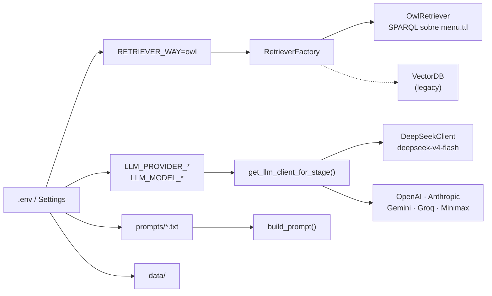
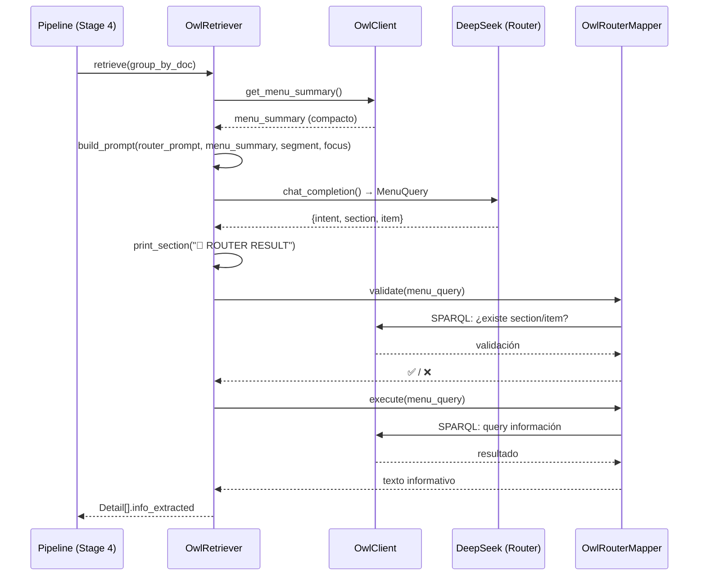

# Arquitectura — Sabor Casero Assistant

```mermaid
%%{
  init: {
    'theme': 'base',
    'themeVariables': {
      'primaryColor': '#25253e',
      'primaryTextColor': '#e0e0e0',
      'primaryBorderColor': '#4a4a6a',
      'lineColor': '#6a6a8a',
      'secondaryColor': '#16213e',
      'tertiaryColor': '#0f3460',
      'clusterBkg': '#0d1b2a',
      'clusterBorder': '#1b2838',
      'nodeBorder': '#4a4a6a',
      'nodeTextColor': '#e0e0e0'
    }
  }
}%```

---

## 1. HARNESS — Entry Points

```mermaid
graph TB
    main["main.py<br/>--mode {gradio,cli}"]
    gradio["Gradio UI<br/>gradio_app.py<br/>puerto 7860"]
    cli["CLI loop<br/>run_cli()"]
    api["API<br/>(comentado)"]
    config["Settings<br/>environment.py"]
    infra["Repositorios JSON<br/>Order · Session · Log · Summary"]
    extractor["RetrieverFactory"]
    assistant["SaborCaseroAssistant<br/>core/assistant.py"]

    main --> gradio
    main --> cli
    main -.-> api
    gradio --> assistant
    cli --> assistant
    assistant --> config
    assistant --> infra
    assistant --> extractor
```

---

## 2. PIPELINE — 9 Stages

```mermaid
graph LR
    msg["🧑 Mensaje"]
    s0["STAGE 0<br/>Input Guard<br/>⚡crítico"]
    s1["STAGE 1<br/>Session Prep"]
    s2["STAGE 2<br/>LLM Guard"]
    s3["STAGE 3<br/>Classification<br/>⚡crítico"]
    s4{"requires_RAG?"}
    s4r["STAGE 4<br/>RAG · OwlRetriever"]
    s4s["skip"]
    s5["STAGE 5<br/>Order Processing"]
    s6["STAGE 6<br/>Response<br/>⚡crítico"]
    s7["STAGE 7<br/>Logging"]
    s8["STAGE 8<br/>Summarization<br/>🔥fire & forget"]
    resp["💬 Respuesta"]

    msg --> s0
    s0 --> s1
    s1 --> s2
    s2 --> s3
    s3 --> s4
    s4 -- Sí --> s4r
    s4 -- No --> s4s
    s4r --> s5
    s4s --> s5
    s5 --> s6
    s6 --> s7
    s7 --> s8
    s8 -.-> resp
    s6 --> resp

    style s0 fill:#5c1a1a,stroke:#8a2e2e,color:#fff
    style s3 fill:#5c1a1a,stroke:#8a2e2e,color:#fff
    style s6 fill:#5c1a1a,stroke:#8a2e2e,color:#fff
    style s8 fill:#1a3a5c,stroke:#2e5a8a,color:#fff
```



---

## 3. CLEAN ARCHITECTURE — Capas

```mermaid
graph TB
    subgraph DOMAIN["DOMAIN LAYER"]
        models["Order · OrderItem · Session"]
        interfaces["OrderRepoInterface<br/>SessionRepoInterface"]
        intent["QueryTopic · QueryType · Detail"]
        ret_iface["RetrieverInterface"]
    end

    subgraph APP["APPLICATION LAYER"]
        orch["SaborCaseroAssistant<br/>orquestador de pipeline"]
        classif["HybridClassifier<br/>StructuredConvManager<br/>InputGuard"]
        order_proc["OrderProcessor<br/>OrderOrchestrator<br/>ActionPlanner<br/>OrderFlowTracker"]
        response["ResponseBuilder<br/>ConversationStateManager"]
        extract["OwlRetriever<br/>OwlRouterMapper<br/>RetrieverFactory"]
        memory["ContextSummarizer"]
        conv_log["ConversationLogger"]
        user_prefs["UserPreferences"]
        agent["StageResult · SessionContext"]
        knowledge["KnowledgeRegistry"]
    end

    subgraph INFRA["INFRASTRUCTURE LAYER"]
        llm["LLMClient (abstract)<br/>get_llm_client_for_stage()"]
        providers["DeepSeekClient<br/>OpenAI · Anthropic · Gemini<br/>Groq · Minimax"]
        owl["OwlClient<br/>(SPARQL)"]
        repos["JsonOrderRepository<br/>JsonSessionRepository<br/>JsonConvLogRepository<br/>JsonSummaryRepository"]
        ui["GradioAssistantApp"]
        config["Settings<br/>pydantic-settings"]
        utils["build_prompt() · print_section()<br/>retry_with_backoff()"]
    end

    DOMAIN --> APP
    APP --> INFRA
```



---

## 4. CONFIG → PIPELINE ROUTING



---

## 5. FLUJO DETALLADO: OwlRetriever + LLM Router



---

## 6. MAPA DE ARCHIVOS

```
src/
├── main.py                        → entry point (gradio/cli)
├── config/
│   └── environment.py             → Settings (pydantic-settings)
├── core/
│   ├── assistant.py               → SaborCaseroAssistant (pipeline)
│   ├── agent/
│   │   └── stage_result.py        → StageResult, SessionContext
│   ├── classifier/
│   │   ├── hybrid.py              → HybridClassifier
│   │   ├── intent.py              → QueryTopic, QueryType, Detail
│   │   ├── input_guard.py         → guard checks
│   │   └── structured_conversation_manager.py
│   ├── conversation_log/
│   │   └── application/
│   │       └── conversation_logger.py
│   ├── extractor/
│   │   ├── owl_retriever.py       → OwlRetriever (SPARQL)
│   │   ├── owl_router_schema.py   → MenuQuery (Pydantic)
│   │   ├── owl_router_mapper.py   → valida + ejecuta queries
│   │   ├── llm_extractor.py       → legacy
│   │   ├── retriever_interface.py → abstract base
│   │   └── retriever_factory.py
│   ├── knowledge/
│   │   └── registry.py
│   ├── memory/
│   │   └── application/
│   │       └── context_summarizer.py
│   ├── order/
│   │   ├── domain/                → models, interfaces
│   │   ├── application/           → processor, orchestrator, planner, tracker
│   │   └── infrastructure/        → JSON repos
│   ├── response/
│   │   ├── response_builder.py    → ResponseBuilder
│   │   └── manager.py             → ConversationStateManager
│   └── user/
│       └── preferences.py
├── infrastructure/
│   ├── llm_client.py              → abstract + factory + stage router
│   ├── owl_client.py              → OwlClient (SPARQL)
│   └── providers/
│       ├── deepseek_client.py
│       ├── openai_client.py
│       ├── anthropic_client.py
│       ├── gemini_client.py
│       ├── groq_client.py
│       └── minimax_client.py
├── ui/
│   └── gradio_app.py              → GradioAssistantApp
└── utils/
    ├── utils.py                   → build_prompt(), print_section()
    ├── retry.py                   → retry_with_backoff()
    └── config.py                  → legacy YAML loader
```
